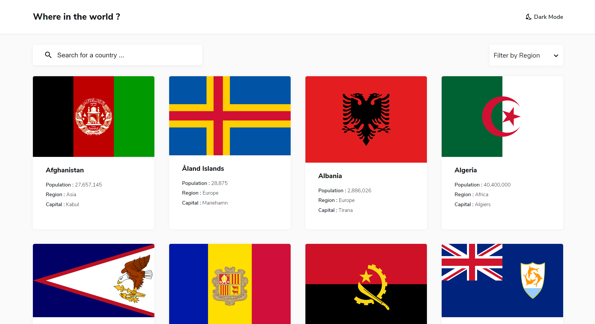
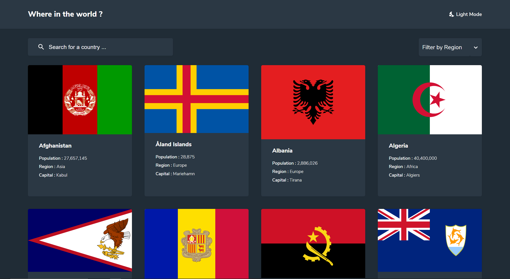

# Frontend Mentor - REST Countries API with color theme switcher solution

This is a solution to the [REST Countries API with color theme switcher challenge on Frontend Mentor](https://www.frontendmentor.io/challenges/rest-countries-api-with-color-theme-switcher-5cacc469fec04111f7b848ca). Frontend Mentor challenges help you improve your coding skills by building realistic projects. 

## Overview

### The challenge

Users should be able to:

- See all countries from the API on the homepage
- Search for a country using an `input` field
- Filter countries by region
- Click on a country to see more detailed information on a separate page
- Click through to the border countries on the detail page
- Toggle the color scheme between light and dark mode *(optional)*

### Screenshot
- Light Mode

- Dark Mode

### Links

- [Solution URL](https://moussamamadou.github.io/countries-app/)

## My process

### Built with

- HTML/CSS 
- SASS - For styles
- [React](https://reactjs.org/) - JS Library (react-router-dom, react-select)
- [Material UI](https://material-ui.com/components/icons/) - For Icons
- [REST Countries API](https://restcountries.eu/) - For Countries Data

### What I learned

This is the first project I built with ReactJS. It helped me understand how it works and how to think in React. 
I was able to use different hook like (useState, useEffect, useRef or useContext) to problem solve.

## Author

- Website - [Moussa Mamadou](http://www.moussamamadou.com)
- Frontend Mentor - [@moussamamadou](https://www.frontendmentor.io/profile/moussamamadou)

